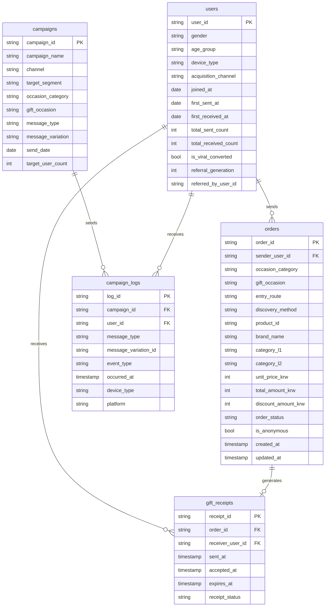

# 카카오톡 선물하기 CRM 분석 프로젝트 계획서

> 작성일: 2026-04-03
> 프로젝트: RFM 세그멘테이션 + LTV + Viral Loop 분석

---

## 1. 프로젝트 개요

### 배경

카카오톡 선물하기 마케팅팀 어시스턴트 JD 기반 포트폴리오.
JD 핵심 키워드: **CRM 마케팅**, **고객 데이터 분석**, **인사이트 도출 → 액션 플랜**.

선물하기 서비스는 일반 이커머스와 다른 고유한 구조를 가짐:
- 발신자(구매자) ≠ 수신자(수령자)
- 선물 받은 경험이 신규 구매자의 70%+ 를 만들어냄 (Viral Loop)
- 연 1회 이벤트(빼빼로데이, 어버이날 등)가 GMV의 대부분을 견인

### 분석 목표

> "세그먼트별 고객 특성과 LTV를 파악하고,
>  선물하기 고유의 Viral Loop 구조를 분석하여
>  CRM 캠페인 전략과 마케팅 액션 플랜을 도출한다."

---

## 2. 분석 구조 (4 Layer)

```
Layer 1. EDA & 시즌 분석
         └─ MoM GMV 트렌드 + 시즌 이벤트 YoY 비교
         └─ 카테고리 믹스, 유저 분포, 구매 패턴

Layer 2. RFM 세그멘테이션
         └─ 12개월 기준 R/F/M 스코어링 (NTILE 5분위)
         └─ 11개 Named Segment 분류
         └─ 세그먼트별 GMV 기여도

Layer 3. LTV 분석
         └─ 월별 코호트 × 1/3/6/12개월 누적 LTV
         └─ 세그먼트별 LTV 비교
         └─ 이탈 예측: 세그먼트 이동 패턴

Layer 4. Viral Loop 분석 (선물하기 고유)
         └─ 수신 횟수별 발신자 전환율 (4회 수신 → 30%+ 전환 검증)
         └─ reciprocity_index: N일 내 재발신 비율
         └─ new_giver_acquisition: 캠페인 → 첫 구매 전환
         └─ referral_generation: 바이럴 세대 추적

↓ (모든 분석 결과를 종합)

Layer 5. CRM 캠페인 전략 & 마케팅 액션 플랜
         └─ 세그먼트별 캠페인 타겟 설계
         └─ 시즌 이벤트 발송 전략 (타겟/타이밍/소재 방향)
         └─ Viral Loop 활성화 전략
         └─ 기대 효과 시뮬레이션 (ROAS, block_rate, GMV 기여)
```

---

## 3. 데이터 설계

### 3-1. 분석 기간 및 규모

| 항목 | 내용 | 근거 |
|---|---|---|
| 분석 기간 | **2년** (2023-01-01 ~ 2024-12-31) | YoY 시즌 비교 필요 |
| RFM 기준 윈도우 | 최근 **12개월** | 업계 표준 (Klaviyo, Braze 등) |
| LTV 코호트 기준 | 월별 코호트 × 24개월 추적 | 2년치 데이터로 커버 |
| 시즌 YoY | 2023 vs 2024 주요 이벤트 비교 | 빼빼로데이, 어버이날, 설날 등 |

### 3-2. 테이블별 규모

| 테이블 | 행 수 | 예상 크기 | 근거 |
|---|---|---|---|
| `users` | **50,000명** | ~7 MB | MAU 2,600만의 1/500 스케일 |
| `orders` | **~200,000건** | ~30 MB | 유저당 연 2회 × 2년 |
| `gift_receipts` | **~200,000건** | ~25 MB | orders 1:1 대응 |
| `campaigns` | **~48건** | ~0.1 MB | 월 2건 × 24개월 |
| `campaign_logs` | **~120,000건** | ~15 MB | 캠페인당 발송 ~2,500명 |
| **총합** | **~570,000행** | **~77 MB** | BigQuery 무료 티어로 충분 |

### 3-3. 주요 시즌 이벤트 캘린더 (데이터 생성 반영)

> **리서치 기반 시즌 랭킹 (카카오 공식 데이터):** 빼빼로데이 #1 → 발렌타인데이 #2 → 스승의 날 #3 → 화이트데이 #4 → 수능D-1 #5
> **일평균 거래량:** 60만건(2024년 기준, 2023년은 약 54만건 추정)
> **핵심 인구통계:** 30대 여성 (F20-30대 70%+ 월구매율), MAU 2,600만명(2024.10)

| 이벤트 | 날짜 | GMV 부스트 배율 | 주요 카테고리 | 시즌 랭킹 |
|---|---|---|---|---|
| 설날 | 1월 말~2월 초 | ×3.0 | 한우, 홍삼, 과일세트 | — |
| 발렌타인데이 | 2/14 | ×3.0 | 초콜릿, 디저트, 뷰티 | **#2** |
| 화이트데이 | 3/14 | ×2.0 | 캔디, 화장품 | #4 |
| 어버이날 | 5/8 | ×3.5 | 홍삼, 한우, 화훼 | — |
| 스승의 날 | 5/15 | ×2.5 | 상품권, 뷰티 | **#3** |
| 추석 | 9월 말~10월 초 | ×3.0 | 한우, 건기식, 과일세트 | — |
| 수능 전날 | 11/14~15 | ×2.5 | 찰떡, 초코파이 | #5 |
| 빼빼로데이 | 11/11 | **×12.0** | 빼빼로, 초콜릿, 과자 | **#1 (연중 최고)** |
| 블랙프라이데이 | 11월 넷째 주 (22~29일) | ×1.8 | 뷰티, 라이프스타일, 상품권 | — (선물하기 영향 제한적) |
| 크리스마스 | 12/25 | ×2.5 | 케이크, 뷰티, 완구 | — |
| 연말연시 | 12/31~1/1 | ×1.8 | 주류, 홈파티 | — |

**Self-gift (자기 자신에게 선물) 트렌드**
> 2023~2024년 고성장 카테고리. 전체 주문의 약 10~15% 추정. `gift_occasion = 'self_gift'` + `sender_user_id = receiver_user_id` 패턴으로 식별.
> 뷰티·바우처 카테고리 비중 높음. 20~30대 여성 주도.

---

## 4. 스키마 설계

### 4-1. 필드 명명 규칙 (Naming Convention)

> AB_TEST 프로젝트와 동일한 규칙 적용

**기본 규칙**

| 규칙 | 내용 | 예시 |
|---|---|---|
| 케이스 | `snake_case` 전체 | `sender_user_id` |
| 이벤트명 | `verb_object` 패턴 | `send_gift`, `accept_gift` |
| 타임스탬프 | `_at` suffix | `sent_at`, `accepted_at` |
| 금액 | `_krw` suffix | `total_amount_krw` |
| ID | `_id` suffix | `order_id`, `campaign_id` |
| 비율 지표 | `_rate` / `_cvr` / `_ctr` | `block_rate`, `open_ctr` |
| 불리언 | `is_` prefix | `is_viral_converted`, `is_anonymous` |
| 카운트 | `_count` suffix | `received_count`, `order_count` |
| 세그먼트 | `_segment` suffix | `rfm_segment` |

**허용 이벤트 동사**

| 동사 | 의미 |
|---|---|
| `view` | 화면/페이지 진입 |
| `click` | 버튼/링크 클릭 |
| `send` | 선물 발송 |
| `receive` | 선물 수신 |
| `accept` | 선물 수락 |
| `complete` | 결제/행동 완료 |
| `block` | 채널 차단 |
| `expire` | 유효기간 만료 |
| `exit` | 이탈 |

---

### 4-2. ERD



---

### 4-3. 테이블 상세 정의

#### `users` — 유저 프로필

> RFM 기준: R=`orders.created_at` MAX, F=`total_sent_count`, M=`orders.total_amount_krw` SUM
>
> **리서치 기반 인구통계 분포:**
> - 성별: F 62% / M 38% (30대 여성이 핵심 고객)
> - 연령대: 20대 28% / 30대 38% / 40대 22% / 10대 6% / 50대+ 6%
> - 디바이스: iOS 48% / Android 52%
> - acquisition_channel: gift_received 40% (바이럴 유입이 최대 루트) / organic 30% / ad 20% / search 10%

| # | 컬럼명 | 타입 | RFM | 값 | 설명 |
|---|---|---|---|---|---|
| 1 | `user_id` | STRING | — | `U00001` 형식 | **PK**. 카카오 계정 고유 ID |
| 2 | `gender` | STRING | — | `M` / `F` | 성별. F 62% / M 38% (리서치 기반) |
| 3 | `age_group` | STRING | — | `10대` / `20대` / `30대` / `40대` / `50대+` | 연령대. 30대(38%), 20대(28%), 40대(22%) 순 |
| 4 | `device_type` | STRING | — | `ios` / `android` | 주 사용 디바이스 |
| 5 | `acquisition_channel` | STRING | — | `organic` / `ad` / `gift_received` / `search` | 선물하기를 처음 알게 된 경로. gift_received(40%)가 최대 — 선물 받고 유입하는 Viral 구조 반영 |
| 6 | `first_action_type` | STRING | — | `sent` / `received` | **선물하기를 처음 이용한 행동**. sent=첫 이용이 선물 보내기, received=첫 이용이 선물 받기 |
| 7 | `referral_generation` | INT64 | — | `0` / `1` / `2`... | 바이럴 세대. 0=오가닉, 1=누군가에게 받고 전환, 2=1세대가 선물 보낸 사람이 전환 |
| 8 | `referred_by_user_id` | STRING | — | FK → users / null | 나를 처음 선물하기로 이끈 발신자 ID. 오가닉이면 null |

> **정규화 원칙:** `joined_at`, `first_sent_at`, `first_received_at`, `total_sent_count`, `total_received_count`, `is_viral_converted`는 orders/gift_receipts에서 계산되는 **파생값**이므로 raw 테이블에서 제거. 분석 시 아래 뷰로 계산.
>
> **RFM 계산 방법 (orders 집계)**
> ```sql
> SELECT
>   u.user_id,
>   MIN(COALESCE(o.created_at, r.sent_at))          AS joined_at,          -- 첫 선물 행동일
>   MIN(o.created_at)                                AS first_sent_at,
>   MIN(r.sent_at)                                   AS first_received_at,
>   COUNT(DISTINCT o.order_id)                       AS total_sent_count,   -- F
>   COUNT(DISTINCT r.receipt_id)                     AS total_received_count,
>   IF(MIN(o.created_at) > MIN(r.sent_at), true, false) AS is_viral_converted,
>   DATE_DIFF(CURRENT_DATE, MAX(o.created_at), DAY) AS recency_days,       -- R
>   SUM(o.total_amount_krw)                          AS monetary_12m        -- M
> FROM users u
> LEFT JOIN orders o       ON u.user_id = o.sender_user_id
> LEFT JOIN gift_receipts r ON u.user_id = r.receiver_user_id
> GROUP BY u.user_id
> ```

#### `orders` — 선물 주문 (발신 기준)

> M(Monetary) 원천 테이블. `sender_user_id` + `created_at` + `total_amount_krw` 로 RFM 전부 계산 가능.
> **발신자·수신자 추적:** `orders.sender_user_id` → 누가 보냈는지 / `gift_receipts.receiver_user_id` → 누가 받았는지

| # | 컬럼명 | 타입 | RFM | 값 | 설명 |
|---|---|---|---|---|---|
| 1 | `order_id` | STRING | — | `ORD00001` 형식 | **PK** |
| 2 | `sender_user_id` | STRING | — | FK → users | 선물을 **보낸** 사람. 나에게 선물이면 receiver와 동일 |
| 3 | `occasion_category` | STRING | — | `special` / `daily` | 이벤트 **대분류** (아래 매핑표 참고) |
| 4 | `occasion_subcategory` | STRING | — | `seasonal` / `personal` / `social` / `self` | 이벤트 **중분류** |
| 5 | `gift_occasion` | STRING | — | 19개 값 (아래 매핑표) | 선물 **세부 맥락** |
| 6 | `entry_route` | STRING | — | `friend_list` / `chat_room` / `gift_tab_direct` / `campaign_link` / `search_direct` | 선물하기 **진입 경로** |
| 7 | `discovery_method` | STRING | — | `ranking` / `curation` / `search` / `category_browse` / `campaign_banner` | 탭 안에서 **상품 발견 방법** |
| 8 | `product_id` | STRING | — | `PRD0001` 형식 | 상품 고유 ID |
| 9 | `brand_name` | STRING | — | `빙그레` / `설화수` 등 | 브랜드명 |
| 10 | `category_l1` | STRING | — | `food` / `beauty` / `fashion` / `health` / `voucher` / `lifestyle` | 상품 **대분류** |
| 11 | `category_l2` | STRING | — | 아래 실제 카테고리 참고 | 상품 **중분류** |
| 12 | `unit_price_krw` | INT64 | — | 원화 | 할인 전 상품 단가 |
| 13 | `total_amount_krw` | INT64 | **M 기준** | 원화 | 실제 결제 금액 (할인 후) |
| 14 | `discount_amount_krw` | INT64 | — | 0 이상 | 할인된 금액 |
| 15 | `order_status` | STRING | — | `pending_accepted` / `accepted` / `expired` / `refunded` | 결제/주문 관점 상태. pending_accepted=결제완료·수락대기, accepted=수락완료, expired=기간만료, refunded=환불 |
| 16 | `is_code_gift` | BOOL | — | `true` / `false` | 코드선물 여부. true면 링크/코드로 전달 → 발신자 미노출 (깜짝선물) |
| 17 | `created_at` | TIMESTAMP | **R 기준** | — | 주문 생성 시각 |
| 18 | `updated_at` | TIMESTAMP | — | — | 주문 상태 마지막 변경 시각 |

**occasion 3단 계층 전체 매핑표**

| occasion_category | occasion_subcategory | gift_occasion | 현실 상황 | 시기 |
|---|---|---|---|---|
| `special` | `seasonal` | `new_year` | 설날 선물세트 | 1~2월 |
| `special` | `seasonal` | `valentines_day` | 초콜릿·향수 | 2/14 |
| `special` | `seasonal` | `white_day` | 사탕·립스틱 | 3/14 |
| `special` | `seasonal` | `black_day` | 짜장면·블랙 테마 | 4/14 |
| `special` | `seasonal` | `parents_day` | 홍삼·한우·카네이션 | 5/8 |
| `special` | `seasonal` | `teachers_day` | 상품권·뷰티 | 5/15 |
| `special` | `seasonal` | `coming_of_age_day` | 향수·주얼리 | 5월 셋째 월요일 |
| `special` | `seasonal` | `chuseok` | 추석 선물세트 | 9~10월 |
| `special` | `seasonal` | `suneung` | 찰떡·초코파이 | 11월 중순 |
| `special` | `seasonal` | `pepero_day` | 빼빼로 (최고 GMV) | 11/11 |
| `special` | `seasonal` | `black_friday` | 뷰티·라이프스타일 할인 | 11월 넷째 주 |
| `special` | `seasonal` | `christmas` | 케이크·홀리데이 | 12/25 |
| `special` | `seasonal` | `year_end` | 주류·다이어리 | 12/31 |
| `special` | `seasonal` | `day33` | 커플 기념일 (33일·100일 등) | 상시 |
| `daily` | `personal` | `birthday` | 생일 (전체 GMV 25%) | 상시 |
| `daily` | `social` | `congratulations` | 취업·승진·결혼·출산·이사 | 상시 |
| `daily` | `social` | `get_well` | 병문안·위로 | 상시 |
| `daily` | `social` | `apology` | 사과·화해 | 상시 |
| `daily` | `social` | `daily_cheer` | "오늘도 고생했어" 커피쿠폰 | 상시 |
| `daily` | `social` | `thank_you` | 감사 인사 | 상시 |
| `daily` | `social` | `just_because` | 특별한 이유 없이 | 상시 |
| `daily` | `self` | `self_gift` | 나에게 보상 구매 | 상시 |

**상품 카테고리 실제 기준 (카카오 선물하기 기반)**

| category_l1 | category_l2 값들 |
|---|---|
| `food` | `cafe_bakery` / `cake` / `fruit` / `snack` / `set_gift` / `drink` |
| `beauty` | `skincare` / `makeup` / `perfume` / `hair_body` |
| `health` | `red_ginseng` / `supplements` / `wellness` / `massage_device` |
| `fashion` | `jewelry` / `accessories` / `clothing` |
| `lifestyle` | `home_living` / `digital` / `stationery` / `toy` / `flower` |
| `voucher` | `cafe_voucher` / `convenience_store` / `department_store` / `culture` / `restaurant` |

**entry_route 값 설명**

| 값 | 진입 경로 | 분석 포인트 |
|---|---|---|
| `friend_list` | 카카오톡 친구 목록 → 선물하기 버튼 | 생일 GMV 25% 핵심 루트 |
| `chat_room` | 1:1 채팅방 → 선물하기 버튼 | 친밀도 높은 관계 |
| `gift_tab_direct` | 선물하기 탭 직접 진입 | 능동적 탐색 유저 |
| `campaign_link` | 카카오 채널 메시지 링크 클릭 | 캠페인 직접 기여 측정 |
| `search_direct` | 카카오톡 검색 → 선물하기 | 검색 의도 명확 |

**discovery_method 값 설명**

| 값 | 탐색 방법 | 분석 포인트 |
|---|---|---|
| `ranking` | 베스트셀러/랭킹 탭 탐색 후 구매 | Ranking 효율 측정 |
| `curation` | 개인화 추천(큐레이션) 탭 탐색 후 구매 | Curation 효율 측정 |
| `search` | 검색어 입력 후 구매 | 검색 의도 기반 구매 |
| `category_browse` | 카테고리 탭 직접 탐색 후 구매 | 능동적 탐색 패턴 |
| `campaign_banner` | 캠페인 배너/기획전 클릭 후 구매 | 기획전 기여도 |

#### `gift_receipts` — 선물 수신 기록

| # | 컬럼명 | 타입 | 설명 |
|---|---|---|---|
| 1 | `receipt_id` | STRING | **PK** |
| 2 | `order_id` | STRING | **FK** → orders.order_id (1:1) |
| 3 | `receiver_user_id` | STRING | **FK** → users.user_id (카카오 계정 연동 시) |
| 4 | `accepted_at` | TIMESTAMP | 수신자가 수락한 시각 (null이면 미수락) |
| 5 | `expires_at` | TIMESTAMP | 수락 유효기간 만료 시각. 보통 orders.created_at + 30일 |
| 6 | `receipt_status` | STRING | `pending` / `accepted` / `expired` / `option_changed` | 수신자 행동 관점 상태. pending=미확인, accepted=수락, expired=기간만료, option_changed=옵션 변경 후 수락 |

> **`sent_at` 삭제:** `orders.created_at`과 동일 시각이므로 중복 제거. 발신 시각이 필요하면 orders JOIN.
> **"나에게 선물하기" 구현:** `orders.gift_occasion = 'self_gift'` 이고 `orders.sender_user_id = gift_receipts.receiver_user_id` 인 레코드.

#### `campaigns` — CRM 캠페인

> 캠페인 = 마케터가 특정 유저 그룹에게 카카오톡 메시지를 기획해서 보내는 것 1건.
> 예: "빼빼로데이 D-3, At Risk 세그먼트 3,000명에게 랭킹 기반 메시지(B안) 친구톡 발송" = 캠페인 1행

| # | 컬럼명 | 타입 | 값 | 설명 |
|---|---|---|---|---|
| 1 | `campaign_id` | STRING | `CMP001` 형식 | **PK** |
| 2 | `campaign_name` | STRING | `2024_pepero_at_risk_B` 등 | 날짜+이벤트+세그먼트+variant 조합 |
| 3 | `channel` | STRING | `friendtalk` / `brand_message` / `in_app_message` | 발송 채널. friendtalk=채널 친구 대상 마케팅 메시지, brand_message=광고수신 동의자까지 확장 발송, in_app_message=앱 내 팝업 |
| 4 | `target_segment` | STRING | `champions` / `at_risk` / `new_customers` 등 | 이 캠페인이 타겟한 RFM 세그먼트 |
| 5 | `occasion_category` | STRING | `special` / `daily` | 연계 이벤트 대분류 |
| 6 | `occasion_subcategory` | STRING | `seasonal` / `personal` / `social` / `self` | 연계 이벤트 중분류 |
| 7 | `gift_occasion` | STRING | 위 21개 값 / `none` | 연계 이벤트 세부값. 시즌 무관이면 none |
| 8 | `message_type` | STRING | `curation` / `ranking` / `discount` / `seasonal` | **소재 전략 유형.** curation=유저 개인 취향·구매이력 기반 상품 추천("Sophie님이 좋아할 향수"), ranking=전체 베스트셀러 순위 기반("이번 주 인기 선물 TOP10"), discount=할인/쿠폰 혜택 중심("지금 선물하면 20% 할인"), seasonal=시즌 이벤트 테마("어버이날 D-3 홍삼 선물") |
| 9 | `message_variation` | STRING | `A` / `B` | **A/B 테스트 소재 버전 식별자.** message_type과 독립적 — seasonal 캠페인도 A(감성 카피) vs B(혜택 강조)로 나눌 수 있음 |
| 10 | `send_date` | DATE | — | 캠페인 발송일 |
| 11 | `target_user_count` | INT64 | — | 발송 대상 유저 수 |

#### `campaign_logs` — 캠페인 이벤트 로그

> Braze Currents 표준 컬럼 구조 참고.
> 1명의 유저가 1개 캠페인에서 최대 5개 이벤트 발생 (send→open→click→purchase or block).
> 캠페인 48건 × 평균 발송 2,500명 × 평균 이벤트 1건 = 약 120,000행

| # | 컬럼명 | 타입 | 값 | 설명 |
|---|---|---|---|---|
| 1 | `log_id` | STRING | `LOG000001` 형식 | **PK** |
| 2 | `campaign_id` | STRING | FK → campaigns | 어느 캠페인의 로그인지 |
| 3 | `user_id` | STRING | FK → users | 이벤트 주체 유저 |
| 4 | `message_type` | STRING | `curation` / `ranking` / `discount` / `seasonal` | 이 유저에게 발송된 소재 전략 유형 (campaigns.message_type과 동일값, 조인 편의용 비정규화) |
| 5 | `message_variation_id` | STRING | `A` / `B` | 이 유저에게 발송된 A/B 소재 버전 |
| 6 | `event_type` | STRING | `send` / `open` / `click` / `block` / `purchase` | 이벤트 종류. send=발송됨, open=메시지 열람, click=상품 클릭, block=채널 차단, purchase=구매 완료 |
| 7 | `occurred_at` | TIMESTAMP | — | 이벤트 발생 시각. send→open→click→purchase 시간 순 |
| 8 | `device_type` | STRING | `ios` / `android` | 이벤트 발생 디바이스 |
| 9 | `platform` | STRING | `kakao` | 발송 플랫폼 |

> **Curation vs Ranking A/B 분석 쿼리 예시**
> ```sql
> SELECT
>   message_variation_id,
>   COUNTIF(event_type = 'click') / COUNTIF(event_type = 'send') AS ctr,
>   COUNTIF(event_type = 'purchase') / COUNTIF(event_type = 'click') AS cvr,
>   COUNTIF(event_type = 'block') / COUNTIF(event_type = 'send') AS block_rate
> FROM campaign_logs
> GROUP BY 1
> ```

---

## 5. 분석 Phase 상세

---

### Phase 1. EDA & 시즌 분석

**목표:** 데이터 전체 구조 파악 + 시즌성 패턴 확인 → Phase 2~5의 베이스라인 수립

#### 사전 작업

| 작업 | 내용 | 사용 테이블 |
|---|---|---|
| 데이터 품질 검증 | NULL 비율, 중복 row, FK 무결성 확인 | 전체 5개 테이블 |
| 날짜 파생 컬럼 생성 | `year`, `month`, `year_month`, `day_of_week` | orders, campaign_logs |
| 시즌 더미 컬럼 생성 | `is_season_event` (True/False), `season_name` | orders |
| 유저 첫 행동일 집계 | `joined_at` = MIN(orders.created_at, gift_receipts.accepted_at) | orders, gift_receipts |

#### 분석 항목 및 방법

**1-1. 월별 GMV 트렌드 (MoM)**

- 지표: `SUM(total_amount_krw)`, 주문 건수, AOV
- 방법: 월별 집계 → 선 그래프 + 시즌 이벤트 수직선 표시
- 시각화: dual-axis (GMV + 주문건수 동시 표시)
- 기대 인사이트: "GMV는 성장하지만 AOV는 하락 → 소액 선물 증가(self_gift 트렌드) 가설"

**1-2. 시즌 이벤트 YoY 비교**

- 지표: 시즌별 GMV / 주문건수 / AOV (2023 vs 2024)
- 방법: `Normalized Index` (기준: 비시즌 월 평균 = 100) → 같은 스케일에서 비교
  ```sql
  -- 비시즌 평균 GMV 계산 후 지수화
  WITH baseline AS (
    SELECT AVG(daily_gmv) AS base_gmv
    FROM daily_summary
    WHERE is_season_event = FALSE
  )
  SELECT
    event_name,
    daily_gmv / base_gmv * 100 AS gmv_index
  FROM daily_summary
  JOIN baseline ON TRUE
  WHERE is_season_event = TRUE
  ```
- 시각화: Grouped bar chart (이벤트별 × 연도별) + 성장률 테이블
- 기대 인사이트: "빼빼로데이 GMV Index 2023(580) → 2024(620) +7% 성장, 어버이날은 역성장"

**1-3. 카테고리 믹스 분석**

- 지표: `category_l1` 기준 GMV 비중 (분기별)
- 방법: 누적 100% 막대 차트 (Stacked Bar) + HHI(Herfindahl-Hirschman Index) 집중도 지표
  ```python
  # HHI: 카테고리 집중도 측정 (0~1, 높을수록 특정 카테고리 편중)
  category_share = df.groupby('category_l1')['total_amount_krw'].sum()
  category_share = category_share / category_share.sum()
  hhi = (category_share ** 2).sum()
  # HHI < 0.25: 분산, 0.25~0.35: 중간, > 0.35: 편중
  ```
- 기대 인사이트: "시즌 이벤트 기간 HHI 급상승(food 쏠림) → 비시즌 Beauty/Health 캠페인 기회"

**1-4. 이상치 탐지 (시즌 피크 vs 진짜 이상치 구분)**

- 방법: 시즌 더미 기반 3σ 룰
  ```python
  # 비시즌 기간의 평균/표준편차로 상한선 설정
  nonseason_mean = df[~df['is_season']]['daily_gmv'].mean()
  nonseason_std  = df[~df['is_season']]['daily_gmv'].std()
  upper_bound = nonseason_mean + 3 * nonseason_std

  # 시즌 기간은 별도 기준 적용 (×8 이상이면 이상)
  df['is_anomaly'] = (
      (~df['is_season'] & (df['daily_gmv'] > upper_bound)) |
      (df['is_season'] & (df['daily_gmv'] > nonseason_mean * 8))
  )
  ```

**1-5. 진입 경로 및 상품 발견 방법 분석**

- 지표: `entry_route` × `discovery_method` 별 GMV / 전환율
- 기대 인사이트: "ranking 발견 → friend_list 진입 경로가 AOV 최고"

**1-6. 선물 수락률 & 캠페인 차단율**

| 지표 | 계산식 | 목표 기준 |
|---|---|---|
| 수락률 | `COUNT(accepted) / COUNT(*)` by gift_receipts | 이벤트별 비교 |
| 차단율 | `COUNT(block) / COUNT(send)` by campaign_logs | < 1% 유지 목표 |
| 만료율 | `COUNT(expired) / COUNT(*)` | 높으면 UX 개선 필요 |

**산출 시각화 목록**
1. 월별 GMV 트렌드 선 그래프 (시즌 이벤트 수직선 포함)
2. 시즌 YoY Grouped Bar Chart + Normalized Index
3. 카테고리 믹스 Stacked Bar (분기별)
4. entry_route × discovery_method 히트맵
5. 이상치 탐지 플롯 (3σ 경계선 포함)

---

### Phase 2. RFM 세그멘테이션

**목표:** 최근 12개월(2024년) 기준 고객 세분화 → Phase 3 LTV 및 Phase 5 캠페인 전략의 기반

#### 사전 작업

| 작업 | 내용 | 사용 테이블 |
|---|---|---|
| RFM 집계 뷰 생성 | 유저별 R/F/M 원시값 계산 | orders |
| 분석 기간 필터 | `created_at BETWEEN '2024-01-01' AND '2024-12-31'` | orders |
| 0회 구매 유저 처리 | LEFT JOIN으로 포함, R=최대, F=0, M=0 처리 | users, orders |
| F 구간 커스텀 설계 | 선물하기 저빈도 특성 반영 (아래 참고) | — |

**F 점수 커스텀 구간 (선물하기 특성 반영)**
> 일반 이커머스(연 10~30회)와 달리 선물하기는 연 1~4회가 고빈도.
> NTILE(5) 그대로 쓰면 대부분이 1~2점으로 쏠림 → 비즈니스 기반 구간 적용

| 연간 구매 횟수 | F 점수 | 의미 |
|---|---|---|
| 5회 이상 | 5 | 초고빈도 (시즌 전부 챙김) |
| 4회 | 4 | 고빈도 (주요 시즌 모두) |
| 3회 | 3 | 중간 |
| 2회 | 2 | 저빈도 |
| 1회 | 1 | 최저 (1회 구매) |

#### 분석 방법

**2-1. R/F/M 점수 계산 (BigQuery)**

```sql
WITH rfm_raw AS (
  SELECT
    u.user_id,
    DATE_DIFF('2024-12-31', MAX(o.created_at), DAY) AS recency_days,
    COUNT(DISTINCT o.order_id)                        AS frequency,
    COALESCE(SUM(o.total_amount_krw), 0)              AS monetary
  FROM users u
  LEFT JOIN orders o
    ON u.user_id = o.sender_user_id
    AND o.created_at BETWEEN '2024-01-01' AND '2024-12-31'
    AND o.order_status != 'refunded'
  GROUP BY u.user_id
),
rfm_scored AS (
  SELECT
    user_id,
    recency_days,
    frequency,
    monetary,
    -- R: 최근일수록 높은 점수 (역순)
    NTILE(5) OVER (ORDER BY recency_days DESC) AS r_score,
    -- F: 커스텀 구간
    CASE
      WHEN frequency >= 5 THEN 5
      WHEN frequency = 4  THEN 4
      WHEN frequency = 3  THEN 3
      WHEN frequency = 2  THEN 2
      ELSE 1
    END AS f_score,
    -- M: 분위수
    NTILE(5) OVER (ORDER BY monetary) AS m_score
  FROM rfm_raw
)
SELECT
  user_id, r_score, f_score, m_score,
  r_score + f_score + m_score AS rfm_total,
  CASE
    WHEN r_score >= 4 AND f_score >= 4                          THEN 'Champions'
    WHEN r_score >= 3 AND f_score >= 3                          THEN 'Loyal Customers'
    WHEN r_score >= 4 AND f_score BETWEEN 2 AND 3              THEN 'Potential Loyalists'
    WHEN r_score = 5  AND f_score = 1                           THEN 'New Customers'
    WHEN r_score = 4  AND f_score = 1                           THEN 'Promising'
    WHEN r_score = 3  AND f_score = 3                           THEN 'Need Attention'
    WHEN r_score = 3  AND f_score <= 2                          THEN 'About to Sleep'
    WHEN r_score <= 2 AND f_score >= 3                          THEN 'At Risk'
    WHEN r_score <= 2 AND f_score >= 4 AND m_score >= 3         THEN "Can't Lose Them"
    WHEN r_score <= 2 AND f_score <= 2                          THEN 'Hibernating'
    WHEN r_score = 1  AND f_score = 1                           THEN 'Lost'
    ELSE 'Others'
  END AS rfm_segment
FROM rfm_scored
```

**2-2. 세그먼트별 GMV 기여도 분석**

- 지표: 세그먼트별 유저 수 비중 vs GMV 비중 (Pareto 검증)
- 기대 인사이트: "Champions 15% 유저 → GMV 45% 기여 (파레토 80/20 검증)"

**2-3. 세그먼트 이동 추적 (Window Function)**

> 3개월 전 세그먼트 → 현재 세그먼트 변화 분석

```sql
-- Sankey용 전환 행렬: "Champions → At Risk" 이동 감지
WITH prev_rfm AS (
  -- 6개월 전 RFM (2024-01~2024-06)
  ...
),
curr_rfm AS (
  -- 최근 6개월 RFM (2024-07~2024-12)
  ...
)
SELECT
  p.rfm_segment AS from_segment,
  c.rfm_segment AS to_segment,
  COUNT(*) AS user_count
FROM prev_rfm p
JOIN curr_rfm c ON p.user_id = c.user_id
GROUP BY 1, 2
ORDER BY user_count DESC
```

**11개 Named Segment 정의 (Klaviyo RFM Best Practice 기준)**

| 세그먼트 | RFM 조건 | GMV 기여도 예상 | CRM 목표 |
|---|---|---|---|
| Champions | R≥4, F≥4 | 40~50% | Lock-in: VIP 혜택, 신상품 우선 |
| Loyal Customers | R≥3, F≥3 | 20~25% | Retention: 정기 쿠폰, 생일 이벤트 |
| Potential Loyalists | R≥4, F=2~3 | 8~10% | Convert: 다음 구매 리마인더 |
| New Customers | R=5, F=1 | 3~5% | Onboard: 첫 구매 감사 + 가이드 |
| Promising | R=4, F=1 | 2~3% | Nurture: 다음 기념일 안내 |
| Need Attention | R=3, F=3 | 5~7% | Re-engage: 쿠폰 |
| About to Sleep | R=3, F≤2 | 2~3% | Wake-up: 할인 공세 |
| At Risk | R≤2, F≥3 | 8~12% | **긴급** 재활성화: 10~15% 할인 |
| Can't Lose Them | R≤2, F≥4, M≥3분위 | 5~8% | 최우선 관심: 담당자 케어 |
| Hibernating | R≤2, F≤2 | 3~5% | Win-back: 신상품 알림 |
| Lost | R=1, F=1 | <1% | 선택적: 재활성화 비용 vs 기대 수익 판단 |

**산출 시각화 목록**
1. Treemap (세그먼트별 유저 수 × GMV 기여도) — 메인
2. R×F Heatmap (세그먼트 분포) — 보조
3. Bubble Chart (R×F, 버블 크기=M) — 3변수 동시 표현
4. Sankey Diagram (6개월 전 → 현재 세그먼트 이동 흐름)

---

### Phase 3. LTV 코호트 분석

**목표:** 코호트별 누적 LTV + 시즌 유입 코호트 프리미엄 정량화 → 시즌 캠페인 ROI 근거 도출

#### 사전 작업

| 작업 | 내용 | 사용 테이블 |
|---|---|---|
| 코호트 월 정의 | 유저의 첫 주문 월 = cohort_month | users + orders |
| 경과 개월 계산 | `DATE_DIFF(order_month, cohort_month, MONTH)` | orders |
| 시즌 코호트 분류 | cohort_month가 11월/5월/2월이면 `is_season_cohort = TRUE` | — |
| 유저당 누적 GMV | cohort × months_elapsed 기준 집계 | orders |

#### 분석 방법

**3-1. 월별 코호트 × 누적 LTV 히트맵**

```sql
WITH user_cohort AS (
  SELECT
    u.user_id,
    DATE_TRUNC(MIN(o.created_at), MONTH) AS cohort_month
  FROM users u
  JOIN orders o ON u.user_id = o.sender_user_id
  GROUP BY u.user_id
),
orders_with_elapsed AS (
  SELECT
    uc.user_id,
    uc.cohort_month,
    DATE_DIFF(
      DATE_TRUNC(o.created_at, MONTH),
      uc.cohort_month,
      MONTH
    ) AS months_elapsed,
    o.total_amount_krw
  FROM user_cohort uc
  JOIN orders o ON uc.user_id = o.sender_user_id
),
cohort_ltv AS (
  SELECT
    cohort_month,
    months_elapsed,
    COUNT(DISTINCT user_id) AS cohort_size,
    SUM(total_amount_krw) / COUNT(DISTINCT user_id) AS avg_ltv_cumulative
  FROM orders_with_elapsed
  WHERE months_elapsed <= 12
  GROUP BY cohort_month, months_elapsed
)
SELECT * FROM cohort_ltv ORDER BY cohort_month, months_elapsed
```

- 시각화: 히트맵 (X축=경과 개월, Y축=코호트 월, 색상=누적 LTV)
- 특징: BG/NBD 모델 대신 실측 누적 LTV 사용 (포트폴리오 수준에서 충분)

**3-2. Retention Curve와 LTV 동시 해석**

| 항목 | Retention Curve | LTV Heatmap |
|---|---|---|
| 측정값 | 활성 유저 비율 (%) | 누적 구매액 (원) |
| 질문 | "6개월 후 몇 % 남나?" | "6개월까지 얼마 썼나?" |
| 함께 해석 | Retention 70% + LTV 200k = ARPU 높은 우량 코호트 |

```python
# Retention curve
retention = cohort_df.div(cohort_df[0], axis=0)  # 1개월차 기준 정규화
sns.heatmap(retention, annot=True, fmt='.0%', cmap='Blues')
```

**3-3. 시즌 코호트 vs 일반 코호트 비교**

```python
# 시즌 코호트 = 11월(빼빼로), 5월(어버이날), 2월(발렌타인)
season_months = [2, 5, 11]
df['is_season_cohort'] = df['cohort_month'].dt.month.isin(season_months)

# 평균 누적 LTV 비교 (1M / 3M / 6M / 12M)
comparison = df.groupby(['is_season_cohort', 'months_elapsed'])['ltv'].mean().unstack()

# t-test: 12M LTV 차이 유의성 검정
from scipy import stats
stat, p = stats.ttest_ind(
    df[df['is_season_cohort']]['ltv_12m'],
    df[~df['is_season_cohort']]['ltv_12m']
)
# p < 0.05 → "시즌 유입 고객은 일반 고객 대비 12M LTV가 통계적으로 유의미하게 높음"
```

- 기대 인사이트: "빼빼로데이 코호트 12M LTV = 일반 코호트 대비 +44% (시즌 캠페인 ROI 근거)"

**3-4. RFM 세그먼트별 LTV 비교**

- Phase 2 세그먼트 × LTV 교차 분석
- 기대 인사이트: "Champions 세그먼트 평균 12M LTV = Hibernating 대비 X배"

**산출 시각화 목록**
1. 코호트 LTV 히트맵 (X=경과 개월, Y=가입월, 색상=누적 LTV)
2. Retention Curve 히트맵 (동일 구조, 값=잔존율%)
3. 시즌 vs 일반 코호트 누적 LTV 라인 차트 + 신뢰구간
4. RFM 세그먼트별 평균 LTV 막대 차트

---

### Phase 4. Viral Loop 분석

**목표:** 선물하기 고유 Viral Loop 구조 정량화 → 카카오 공식 수치(30%+ 전환) 검증 + 캠페인 전략 도출

#### 사전 작업

| 작업 | 내용 | 사용 테이블 |
|---|---|---|
| 수신 횟수 집계 | 유저별 `COUNT(receipt_id) WHERE accepted` | gift_receipts |
| 발신 전환 여부 | `is_viral_converted = (first_sent_at > first_received_at)` | orders, gift_receipts |
| 첫 수신일/첫 발신일 | `MIN(accepted_at)`, `MIN(created_at)` | gift_receipts, orders |
| 바이럴 세대 확인 | `users.referral_generation` 기반 | users |

#### 분석 방법

**4-1. K-factor (Viral Coefficient) 계산**

```
K = i × c
  = 평균 수신 횟수 × 수신자 발신 전환율

K > 1: 바이럴 성장 (지수적)
K < 1: 바이럴 감쇠 (선형)
```

```sql
SELECT
  AVG(received_count)                                    AS avg_invites,   -- i
  COUNTIF(is_viral_converted) / COUNT(*)                AS conv_rate,     -- c
  AVG(received_count) * COUNTIF(is_viral_converted) / COUNT(*) AS k_factor
FROM users
WHERE received_count > 0
```

**4-2. 수신 횟수별 전환율 곡선 (카카오 공식 30%+ 검증)**

```sql
SELECT
  received_count,
  COUNT(*) AS user_count,
  COUNTIF(is_viral_converted) AS converted,
  SAFE_DIVIDE(COUNTIF(is_viral_converted), COUNT(*)) AS conversion_rate
FROM users
WHERE received_count > 0
GROUP BY received_count
ORDER BY received_count
```

- 시각화: 수신 횟수 vs 전환율 S-curve (단순 집계 + 로지스틱 회귀 피팅)
- 검증 목표: "수신 4회 시점에서 전환율 30%+ 재현 (카카오 공식 데이터 일치 확인)"

**4-3. Reciprocity Index (상호성 지수)**

> "선물 받은 후 N일 내 재발신" — 골든타임 도출

```sql
WITH gift_sequence AS (
  SELECT
    r.receiver_user_id AS user_id,
    r.accepted_at,
    MIN(o.created_at) AS next_sent_at,
    DATE_DIFF(MIN(o.created_at), r.accepted_at, DAY) AS days_to_send
  FROM gift_receipts r
  LEFT JOIN orders o
    ON r.receiver_user_id = o.sender_user_id
    AND o.created_at > r.accepted_at
  WHERE r.receipt_status = 'accepted'
  GROUP BY user_id, r.accepted_at
)
SELECT
  COUNTIF(days_to_send BETWEEN 1 AND 7)  / COUNT(*) AS reciprocity_7d,
  COUNTIF(days_to_send BETWEEN 1 AND 14) / COUNT(*) AS reciprocity_14d,
  COUNTIF(days_to_send BETWEEN 1 AND 30) / COUNT(*) AS reciprocity_30d,
  COUNTIF(days_to_send BETWEEN 1 AND 90) / COUNT(*) AS reciprocity_90d
FROM gift_sequence
```

- 기대 인사이트: "수신 후 14일이 골든타임 → 이 시점에 '당신도 선물하세요' 캠페인 발송"

**4-4. 바이럴 세대(Generation) 분포 및 LTV 비교**

```python
# 세대별 유저 분포
gen_dist = users_df['referral_generation'].value_counts().sort_index()

# 세대별 LTV 비교 (Phase 3 결과 활용)
gen_ltv = orders_df.groupby('referral_generation')['total_amount_krw'].agg(['sum','count','mean'])
```

- 시각화: Sankey Diagram (0세대 → 1세대 → 2세대 흐름)
- 기대 인사이트: "1세대 바이럴 유저 LTV = 0세대 오가닉 유저 대비 +X%"

**4-5. 첫 전환까지 소요일 분포**

```python
# days_to_convert = first_sent_at - first_received_at
days_dist = df['days_to_convert'].dropna()
sns.histplot(days_dist, bins=30)
# 중앙값: X일 → "대부분의 전환은 수신 후 Y일 이내 발생"
```

**산출 시각화 목록**
1. 수신 횟수 vs 전환율 S-curve (단순 집계 + 로지스틱 회귀)
2. Reciprocity Index 기간별 막대 그래프 (7/14/30/90일)
3. 바이럴 세대 분포 + 세대별 LTV 비교 차트
4. Sankey Diagram (세대 간 흐름)
5. days_to_convert 히스토그램 (전환 골든타임)

---

### Phase 5. CRM 캠페인 전략 & A/B 테스트 분석

**목표:** Phase 1~4 분석 결과를 마케팅 액션으로 전환 + 캠페인 A/B 테스트 통계 검증

#### 사전 작업

| 작업 | 내용 | 사용 테이블 |
|---|---|---|
| 캠페인별 퍼널 집계 | send → open → click → purchase 전환율 | campaign_logs |
| A/B 비교 테이블 구성 | message_variation별 CTR/CVR/block_rate | campaign_logs |
| 샘플 크기 충족 확인 | 통계 검정 전 각 variation 최소 n 확인 | campaign_logs |
| Phase 2 세그먼트 조인 | campaign_logs.user_id + RFM 세그먼트 | campaign_logs, orders |

#### 분석 방법

**5-1. 캠페인 A/B 테스트 통계 검정 (Chi-square)**

> **Curation(A) vs Ranking(B) 소재 전략** — 이 프로젝트의 핵심 A/B 질문

```python
from scipy.stats import chi2_contingency

# CTR 검정
contingency_ctr = pd.crosstab(
    df_logs['message_variation'],  # A, B
    df_logs['is_click']            # 0, 1
)
chi2, p, dof, expected = chi2_contingency(contingency_ctr)
print(f"CTR Chi-square: χ²={chi2:.3f}, p={p:.4f}")
# → p < 0.05: A/B CTR 차이 유의미

# CVR 검정 (click한 사람 중)
contingency_cvr = pd.crosstab(
    df_logs[df_logs['is_click']==1]['message_variation'],
    df_logs[df_logs['is_click']==1]['is_purchase']
)
chi2_cvr, p_cvr, _, _ = chi2_contingency(contingency_cvr)
```

**5-2. 샘플 크기 사전 계산 (Power Analysis)**

```python
from scipy.stats import norm

# 파라미터
alpha, beta = 0.05, 0.20
p1, p2 = 0.12, 0.15  # 기대 CTR A vs B

z_a = norm.ppf(1 - alpha/2)  # 1.96
z_b = norm.ppf(1 - beta)     # 0.84

n = (z_a + z_b)**2 * (p1*(1-p1) + p2*(1-p2)) / (p1 - p2)**2
print(f"필요 샘플: {int(n):,}명/그룹")
# → 1,847명/그룹 이상이어야 결과 신뢰 가능
```

**5-3. Multiple Testing 보정 (Bonferroni)**

> 캠페인 88건 전체를 동시에 검정 시 우연한 유의성 71.5% 발생
> → Holm-Bonferroni 보정으로 False Positive 제거

```python
from statsmodels.stats.multitest import multipletests

# 모든 캠페인의 p-value 수집 후 일괄 보정
rejected, corrected_p, _, _ = multipletests(p_values, method='holm')
```

**5-4. 세그먼트별 캠페인 반응 차이**

- 지표: 세그먼트별 CTR / CVR / block_rate 비교
- 기대 인사이트: "Champions는 curation에 반응, New Customers는 ranking에 반응 → 소재 개인화 필요"

**5-5. 마케팅 액션 플랜 (Phase 1~4 분석 결과 종합)**

| 세그먼트 | 캠페인 목적 | 메시지 방향 | 채널 | 타이밍 |
|---|---|---|---|---|
| Champions | Lock-in + 상향 구매 | VIP 혜택, 신상품 우선 | friendtalk | 생일 D-7 |
| At Risk | 재활성화 | "오랜만에 선물 어때요?" + 10% 쿠폰 | brand_message | 마지막 구매 후 60일 |
| Can't Lose Them | 긴급 retention | 고가치 고객 전담 혜택 15% 할인 | friendtalk | 마지막 구매 후 45일 |
| New Customers | 2차 구매 유도 | 첫 구매 감사 + 다음 기념일 안내 | in_app_message | 첫 구매 후 7일 |
| 수신 3회+ 미전환 | Viral 전환 촉진 | "이번엔 당신이 선물할 차례" + 쿠폰 | brand_message | 수신 후 14일 (골든타임) |

**5-6. 시즌 이벤트 발송 전략 (Phase 1 YoY 결과 기반)**

| 이벤트 | 발송 타이밍 | 타겟 | 소재 방향 |
|---|---|---|---|
| 빼빼로데이 (#1) | D-7, D-3, D-1 | 20~30대 전체 | Ranking 소재 (CTR 우선) + D-1 Seasonal |
| 어버이날 (#상위) | D-14, D-7 | 20~40대 | Curation 소재 (감성 카피 + 홍삼/한우) |
| 스승의 날 (#3) | D-7 | 20~40대 직장인 | Ranking (상품권 베스트셀러 TOP5) |
| 생일 (상시) | 생일 D-3 | 생일 친구 보유 유저 | 개인화: "OOO님 생일 D-3" |

**5-7. Viral Loop 활성화 전략**

```
① 수신자 전환 촉진 (Phase 4 reciprocity 골든타임 기반)
   → 수신 후 14일: "이번엔 당신이 선물할 차례" brand_message + 첫 구매 쿠폰
   → 수신 3회 도달 시: "이미 3번 받으셨네요! 당신도 선물해보세요"

② K-factor 증대
   → 메시지 카드 채택률 75% 활용 → 공유 CTA 문구 삽입
   → "선물 받은 기쁨을 나눠보세요" 공유 버튼

③ 시즌 기반 New Giver Acquisition
   → 빼빼로데이 D-3: "처음 선물하기" 진입 장벽 낮추는 소재 (1만원대 추천)
```

**5-8. 기대 효과 시뮬레이션**

> Phase 2 세그먼트 실제 크기 + Phase 4 전환율 기반으로 채워 넣을 것

| 전략 | 대상 | 가정 | 기대 GMV |
|---|---|---|---|
| At Risk 재활성화 캠페인 | At Risk (Phase 2 실제 수치) | CVR 5% | GMV +XX만원 |
| Viral 수신자 쿠폰 | 수신 3회+ 미전환 (Phase 4 실제 수치) | 전환율 15% | 신규 발신자 +X명 |
| 빼빼로데이 D-3 발송 | 전체 활성 유저 | CTR 12%, CVR 8% (A/B 실측) | GMV +XXX만원 |

**산출 시각화 목록**
1. 캠페인 퍼널 차트 (send → open → click → purchase, A/B 비교)
2. A/B 소재별 CTR/CVR/block_rate 비교 막대 + p-value 표기
3. 세그먼트별 캠페인 반응 히트맵
4. 기대 효과 시뮬레이션 테이블 (실제 수치 채운 버전)

---

## 6. 현업 마케팅팀 KPI 체계

> 이 프로젝트에서 분석 가능한 지표 전체. 실제 현업에서 일별/월별/분기별로 모니터링하는 KPI 기준.

### 6-1. 일별 모니터링 (Daily Dashboard)

| KPI | 계산식 | 사용 테이블·필드 | 왜 매일 보는가 |
|---|---|---|---|
| GMV | `SUM(total_amount_krw)` | orders | 오늘 얼마 팔렸나 |
| 주문 건수 | `COUNT(order_id)` | orders | 거래량 추이 |
| AOV (평균 주문 금액) | `GMV / 주문건수` | orders | 객단가 변화 |
| 선물 수락률 | `COUNT(accepted) / COUNT(*)` | gift_receipts | 수락 안 하면 GMV 인식 지연 |
| 캠페인 차단율 | `COUNT(block) / COUNT(send)` | campaign_logs | 발송 후 1시간 내 급등 = 즉시 중단 신호 |

### 6-2. 월별 리포트 (Monthly Report)

| KPI | 계산식 | 사용 테이블·필드 | 왜 월별로 보는가 |
|---|---|---|---|
| MoM GMV 성장률 | `(이번달 - 저번달) / 저번달` | orders.created_at | 추세 및 이상치 탐지 |
| 신규 발신자 수 | `COUNT(first_sent_at이 이번달인 유저)` | users.first_sent_at | 유입 성과 |
| 재구매율 | `2회 이상 구매자 / 전체 구매자` | orders GROUP BY sender_user_id | 락인(Lock-in) 여부 |
| 세그먼트별 GMV 기여도 | RFM 세그먼트 × SUM(total_amount_krw) | orders + RFM 계산 | 어디서 매출이 오는지 |
| Viral 전환율 | `COUNT(is_viral_converted=true 신규) / 신규 발신자 수` | users.is_viral_converted | Viral Loop 건강도 |
| 캠페인 CTR | `COUNT(click) / COUNT(send)` | campaign_logs | 소재 효율 |
| 캠페인 CVR | `COUNT(purchase) / COUNT(click)` | campaign_logs | 랜딩 후 구매 전환 |
| entry_route별 GMV | `SUM(total_amount_krw) GROUP BY entry_route` | orders | 진입 루트 최적화 |
| discovery_method별 CVR | `구매건수 / 노출건수 GROUP BY discovery_method` | orders | ranking vs curation 효율 비교 |

### 6-3. 분기별 리뷰 (Quarterly Review)

| KPI | 계산식 | 사용 테이블·필드 | 왜 분기별로 보는가 |
|---|---|---|---|
| 코호트 LTV | 가입월별 누적 GMV (1M/3M/6M/12M) | users.joined_at + orders | 유입 채널·시즌별 고객 가치 비교 |
| RFM 세그먼트 이동 | Champions→At Risk 이탈 수 추적 | orders 윈도우 이동 | 고객 건강도 변화 |
| YoY 시즌 비교 | 빼빼로데이·어버이날 23 vs 24 GMV | orders.gift_occasion + created_at | 시즌 성장/역성장 원인 파악 |
| Reciprocity Index | 수신 후 30일 내 재발신 비율 | gift_receipts.accepted_at + orders.created_at | Viral Loop 상호성 강도 |
| referral_generation별 LTV | 오가닉 vs 1세대 vs 2세대 LTV 비교 | users.referral_generation + orders | 바이럴 유입 고객의 가치 |
| Curation vs Ranking 성과 | A/B별 CTR·CVR·block_rate 비교 | campaign_logs.message_variation_id | 추천 시스템 ROI 판단 |

---

## 8. 기술 스택

| 항목 | 선택 | 이유 |
|---|---|---|
| 데이터 웨어하우스 | **Google BigQuery** | 영구 무료 티어, 한국 JD 출현 빈도 높음 |
| GCP 프로젝트 | `ds-ysy` | AB_TEST와 동일 |
| 데이터셋 | `kakao_gift` | |
| 데이터 생성 | **Python Faker** + random seed 고정 | 재현 가능한 mock 데이터 |
| 분석 언어 | **Python** (pandas, scipy) | |
| 시각화 | **matplotlib** + koreanize-matplotlib | |
| 노트북 | **Jupyter Notebook** | |
| 파티셔닝 | DATE(created_at), DATE(occurred_at) | BigQuery 비용 최적화 |
| 클러스터링 | category_l1, rfm_segment | 자주 필터링하는 컬럼 |

---

## 9. 최종 결과물

| 형태 | 내용 |
|---|---|
| **PPT 보고서** | 분석 결과 + 마케팅 액션 플랜 (메인 결과물) |
| **노션** | 분석 과정 + 인사이트 상세 기록 |
| **GitHub README** | 프로젝트 개요 + 스키마 + 실행 방법 |
| **Jupyter Notebook** | 전체 분석 코드 (재현 가능) |
| **generate_data.py** | 데이터 생성 스크립트 (seed 고정) |

---

## 10. 파일 구성

```
kakao_gift/
├── PLAN.md                  # 본 계획서
├── BIGDATA_TOOLS_REPORT.md  # 빅데이터 툴 & 과금 참고 자료
├── SCHEMA_REFERENCE.md      # 스키마 설계 실무 레퍼런스
├── generate_data.py         # 데이터 생성 스크립트
├── users.csv                # 유저 프로필 (50,000행)
├── orders.csv               # 선물 주문 (~200,000행)
├── gift_receipts.csv        # 선물 수신 기록 (~200,000행)
├── campaigns.csv            # CRM 캠페인 (~48건)
├── campaign_logs.csv        # 캠페인 이벤트 로그 (~120,000행)
├── erd.dbml                 # ERD (dbdiagram.io용)
└── analysis/
    ├── 01_eda_seasonal.ipynb
    ├── 02_rfm_segmentation.ipynb
    ├── 03_ltv_cohort.ipynb
    ├── 04_viral_loop.ipynb
    └── 05_crm_strategy.ipynb
```

---

## 11. 다음 단계

- [x] 리서치 결과 PLAN.md 반영 (시즌 랭킹, 인구통계, self_gift 트렌드)
- [ ] `generate_data.py` 작성 (시즌 패턴 + Viral Loop 반영)
- [ ] BigQuery `kakao_gift` 데이터셋 생성 및 업로드
- [ ] Phase 1 EDA 노트북 작성
- [ ] Phase 2 RFM 세그멘테이션 노트북 작성
- [ ] Phase 3 LTV 코호트 분석 노트북 작성
- [ ] Phase 4 Viral Loop 분석 노트북 작성
- [ ] Phase 5 CRM 전략 문서 작성
- [ ] PPT 보고서 제작
